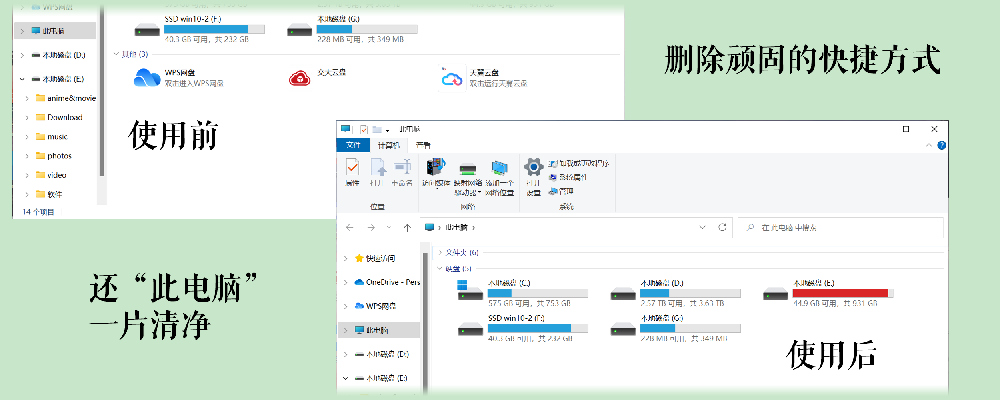
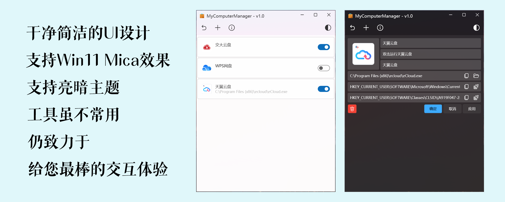

<h1 align="center">MyComputerManager-awa</h1>

<p align="center"><strong>管理「此电脑」中 Shell Namespace 扩展项的增强分支</strong><br>
批量管理 · 64 位注册表兼容性修复 · Win11 风格界面</p>

<p align="center">
  
  
  
  
  <a href="https://github.com/1357310795/MyComputerManager"></a>
</p>

<p align="center">基于 <a href="https://github.com/1357310795/MyComputerManager">1357310795/MyComputerManager</a> v1.03 的二次开发</p>

---

## 目录

- [项目简介](#项目简介)
- [效果预览](#效果预览)
- [功能特性](#功能特性)
- [本分支改动](#本分支改动)
- [快速开始](#快速开始)
- [从源码构建](#从源码构建)
- [项目结构](#项目结构)
- [常见问题](#常见问题)
- [开源许可](#开源许可)
- [致谢](#致谢)

---

## 项目简介

国内不少软件会通过 Shell Extension 把自己的入口强行塞进「此电脑」，既挤占版面，又不像普通快捷方式那样可以直接删除。本工具通过可视化界面管理注册表中的 Shell Namespace 扩展项，让这些条目**可见、可禁用、可删除**，操作安全且可追溯。

本仓库是 [MyComputerManager](https://github.com/1357310795/MyComputerManager) v1.03 的二次开发分支，重点补充**批量操作**能力，并修复源码构建版本在 64 位系统上条目显示不全的问题。

> An enhanced fork of [MyComputerManager](https://github.com/1357310795/MyComputerManager) with batch management features and bug fixes.

---

## 效果预览

<p align="center"><strong>清理前后对比 — 还「此电脑」一片清净</strong></p>

<p align="center"></p>

<p align="center"><strong>干净简洁的界面 · 支持 Win11 Mica 效果与亮 / 暗主题</strong></p>

<p align="center"></p>

<p align="center"><strong>支持添加自定义项目 · 支持命令行参数 · 支持 exe / ico / dll 图标</strong></p>

<p align="center"></p>

---

## 功能特性

### 本分支新增

| 能力 | 说明 |
|---|---|
| 列表多选 | 每个项目左侧新增复选框，支持任意多选 |
| 全选 / 取消全选 | 一键切换全部项目的选中状态，并自动同步「已全选」状态 |
| 批量禁用 | 批量关闭所选项目在「此电脑」中的显示 |
| 批量启用 | 批量恢复所选项目的显示 |
| 批量删除 | 删除前弹出确认对话框，列出待删除项目名称，防止误操作 |
| 操作反馈 | 执行结果以状态提示呈现，失败时给出成功 / 失败数量统计 |

### 沿用上游能力

| 能力 | 说明 |
|---|---|
| 浏览 | 列出「此电脑」中全部 Shell Namespace 扩展项（系统项 + 第三方项） |
| 单项操作 | 启用 / 禁用 / 删除指定项目 |
| 新增项目 | 添加自定义文件夹或命令行入口到「此电脑」 |
| 图标提取 | 支持从 exe / ico / dll 文件提取图标 |
| 界面 | Win11 风格 UI，支持 Mica 效果与亮 / 暗主题 |

---

## 本分支改动

### 新增功能

- **批量管理**：支持全选 / 取消全选、批量禁用、批量启用、批量删除
- **列表多选**：每个项目新增复选框，支持多选操作
- **操作确认**：批量删除前弹出确认对话框，显示待删除项目名称，并明确提示操作不可恢复

### Bug 修复

- **Registry64 兼容性**：修复源码构建版本在 64 位系统上仅显示 1 个项目（应显示 4 个）的问题，通过 `RegistryView.Registry64` 回退机制解决

### 主要改动文件

| 文件 | 类型 | 变更说明 |
|---|---|---|
| `Models/NamespaceItem.cs` | 修改 | 新增 `IsSelected` 属性；修复 `RegKey_CLSID` 的 Registry64 兼容性 |
| `ViewModels/MainPageViewModel.cs` | 修改 | 新增批量操作命令（`BatchDelete` / `BatchDisable` / `BatchEnable` / `ToggleSelectAll`），注入 `IDialogService` |
| `MainWindow.xaml` | 修改 | 顶栏新增批量操作工具栏按钮（始终可见） |
| `MainWindow.xaml.cs` | 修改 | 新增 `GetMainPageVM()` 辅助方法及批量操作事件处理 |
| `Styles/ItemListStyle.xaml` | 修改 | DataTemplate 中新增复选框，绑定 `IsSelected` |
| `Converters/BoolToVisibilityConverter.cs` | 新增 | 布尔值转可见性转换器 |
| `Helpers/NamespaceHelper.cs` | 修改 | 添加 `RegistryView.Registry64` 回退，修复 64 位系统兼容性 |

---

## 快速开始

### 系统要求

| 项目 | 要求 |
|---|---|
| 操作系统 | Windows 10 / 11（推荐 64 位） |
| 运行时 | .NET Framework 4.7.2 |

### 运行

1. 本分支暂未发布预编译安装包，请参照 [从源码构建](#从源码构建) 生成可执行文件。
2. 启动 `MyComputerManager\bin\Release\MyComputerManager.exe`。
3. 在主列表中勾选目标项目，通过顶栏工具栏执行批量禁用 / 启用 / 删除；单项开关可直接点击列表右侧的切换按钮。

> **提示**：若需要删除系统级项目（位于 `HKEY_LOCAL_MACHINE`），请以管理员身份运行程序；否则可能因权限不足导致操作失败。
>
> **提示**：删除操作会移除对应的注册表项，确认对话框中已明确提示**不可恢复**，请在操作前确认选择无误。

如需直接使用原版工具，可前往上游仓库 [1357310795/MyComputerManager](https://github.com/1357310795/MyComputerManager)。

---

## 从源码构建

### 环境要求

- Visual Studio 2019 或更高版本（或独立的 MSBuild + NuGet CLI）
- .NET Framework 4.7.2 开发工具包（Targeting Pack）

### 构建步骤

```bash
# 1. 还原 NuGet 包
nuget restore MyComputerManager.sln

# 2. 编译 Release 版本
msbuild MyComputerManager.sln /p:Configuration=Release
```

### 产物路径

```text
MyComputerManager\bin\Release\MyComputerManager.exe
```

> 也可以直接用 Visual Studio 打开 `MyComputerManager.sln`，选择 `Release` 配置后生成解决方案。

---

## 项目结构

```text
MyComputerManager-1.03/
├─ MyComputerManager/              # WPF 主工程（.NET Framework 4.7.2）
│  ├─ Controls/                    # 自定义控件（PathBox、RegBox、ClippingBorder）
│  ├─ Converters/                  # XAML 值转换器
│  ├─ Extensions/                  # 附加行为扩展
│  ├─ Helpers/
│  │  ├─ Icon/                     # Shell 图标提取（Win32 互操作）
│  │  ├─ Regedit/                  # 注册表读写封装
│  │  └─ NamespaceHelper.cs        # Shell Namespace 项读取与增删改
│  ├─ Models/                      # 数据模型（NamespaceItem 等）
│  ├─ Mvvm/                        # 命令实现（RelayCommand / AsyncRelayCommand）
│  ├─ Services/                    # 服务与契约（导航、对话框、SnackBar、数据）
│  ├─ Styles/                      # 样式资源字典
│  ├─ ViewModels/                  # 视图模型
│  ├─ Views/                       # 页面（MainPage / DetailPage / AboutPage）
│  ├─ MainWindow.xaml(.cs)         # 主窗口与顶栏批量操作入口
│  └─ app.manifest
├─ ReadmeItems/                    # README 配图
├─ Directory.Build.props           # 统一版本号与语言版本
├─ MyComputerManager.sln           # 解决方案文件
└─ LICENSE.txt                     # GPL-3.0 许可全文
```

---

## 常见问题

### 源码构建后，64 位系统上「此电脑」里只显示 1 个项目？

这是原版在源码构建场景下的注册表视图问题。本分支已通过 `RegistryView.Registry64` 回退机制修复，涉及 `Helpers/NamespaceHelper.cs` 与 `Models/NamespaceItem.cs`。

### 点击批量按钮没有反应？

批量操作基于当前的勾选状态，需要先在列表左侧勾选目标项目。若未选中任何项目，程序会以状态提示告知「请先选择要删除的项目 / 请先选择要禁用的项目」。

### 删除操作可以撤销吗？

不可以。删除会直接移除对应的注册表项，确认对话框中已标注「无法恢复」，请在操作前确认选择无误。

---

## 开源许可

本项目基于 **GNU General Public License v3.0** 开源，完整条款见 [LICENSE.txt](LICENSE.txt)。

This project is licensed under the **GNU General Public License v3.0**.

---

## 致谢

- 原项目作者 [@1357310795](https://github.com/1357310795) — [MyComputerManager](https://github.com/1357310795/MyComputerManager)
- [@lepoco](https://github.com/lepoco) — [wpfui](https://github.com/lepoco/wpfui)（Win11 风格控件）
- [@walterlv](https://github.com/walterlv) 与 [@XIU2](https://github.com/XIU2) — [TileTool UI 讨论](https://github.com/XIU2/TileTool/pull/4)
